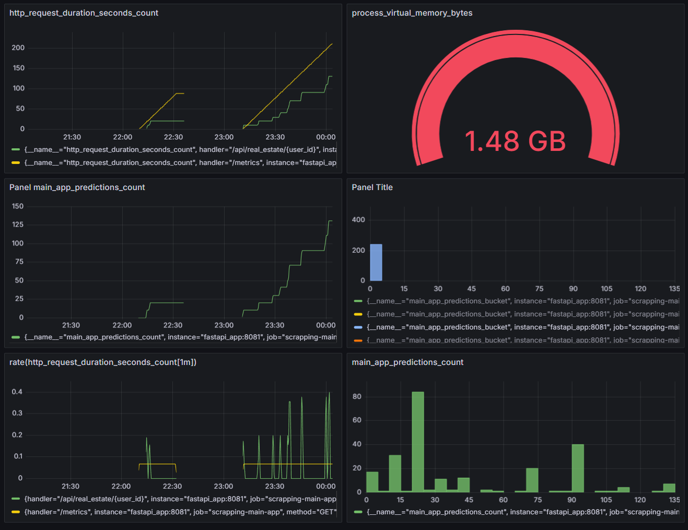

# Мониторинг
Монитооринг осуществляется в Grafana на основании метрик, представленных ниже

## Для мониторинга выбраны метрики нескольких метрик:
- имя метрики
"main_app_predictions",
- описание метрики
"Histogram of predictions")

- имя метрики
"main_app_counter_elite"
- описание метрики
"Count of elite objects")

### Инрфраструткурный 
http_request_duration_seconds_count
main_app_predictions_count
rate(http_request_duration_seconds_count[1m])
process_virtual_memory_bytes

